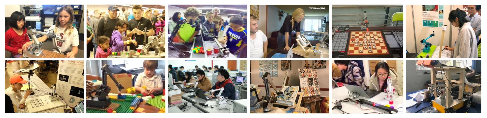
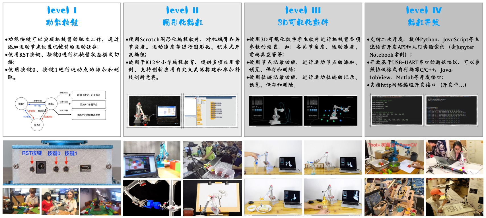
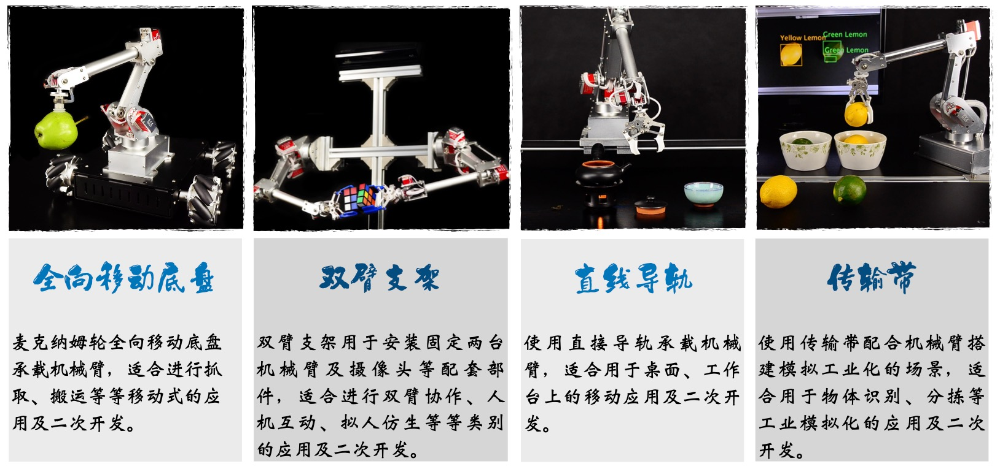
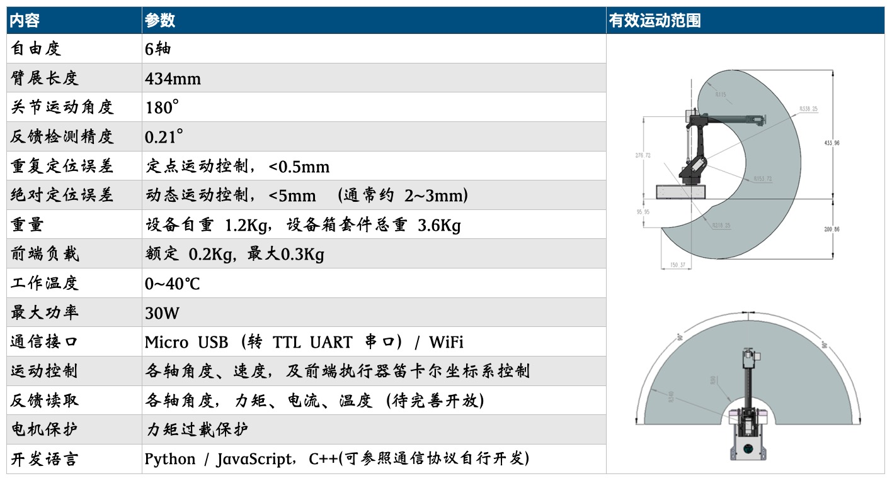

   

# 7Bot桌面智能机械臂 
### [English](docs/README-en.md)

## 简介
7Bot桌面智能机械臂是一款由松果智能（PineconeAI）团队开发设计的桌面机械臂，适用于AI应用场景的快速搭建、测试和部署，具有丰富的功能和使用灵活性。在人工智能教育及科研领域为学生、教师、研究人员、企业及开发者提供一站式的解决方案，在全球范围内被广泛使用。

<iframe src="https://player.bilibili.com/player.html?bvid=BV1UU4y1G7TW&page=1" scrolling="no" border="0" frameborder="no" framespacing="0" allowfullscreen="true"> </iframe>

7Bot机械臂作为通用硬件外设，使用简单易用的二次开发API（应用程序接口），即可非常方便的在计算机、开发板（如英伟达Jetson系列开发板、树莓派、ARM开发板）等等通用平台上进行二次开发。并可无缝结合诸如TensorFlow/Pytorch等深度学习框架、ROS机器人操作系统、OpenCV计算机视觉库等等人工智能及机器人应用工具和资源，进行各类型的人工智能应用开发，以及设计原型的快速搭建。

## 使用
7Bot机械臂简单易用的方式，灵活多样的场景搭建，很适合用在人工智能、机器人领域的科普上面，能够让中小学生在不用懂得复杂深奥的理论基础知识前提下，即可轻松的操作、使用和体验机器人及人工智能应用的诸多乐趣，提高对理工科的学习兴趣和启发学生的创新思考能力。当前支持的使用方式有：

1. 功能按键：设备内置按键操作功能，通过使用设备底座上的功能按键，即可轻松完成机械臂运动试教和运动控制编排；

2. 图形化编程：7Bo结合Scratch支持图形化编程，可通过图形化界面开发和自定义灵活搭建机械臂应用场景；

3. 3D可视化软件：使用配套的3D可视化软件，可直观的设置机械臂各项参数，同过数字孪生效果直观的看到机器人运动轨迹、机器人状态、机器人控制指令等，并可使用软件功能实现复杂的机械臂任务；

4. 编程开发：支持多种通信方式，配套Python语言编程学习、Jupyter Notebook实验案例，以及运动规划、计算机视觉、深度学习等多种应用主题的课程教学实验。

详情请参考[使用说明](docs/usage.md)。

## 外设
7Bot桌面智能机械臂支持多种外设搭配，用于智能应用场景的搭建。

## 特性
7Bot桌面智能机械臂具有以下特性和具体参数：

## 文档
| 序号 | 名称    | 内容  |
|-----|--------|-------|
| 1   | [7Bot桌面机械臂使用说明书](docs/7Bot桌面机械臂使用说明书.pdf)     | 机械臂硬件、使用及开发说明   |
| 2   | [7Bot机械臂编程开发指南(Python版）](docs/7Bot机械臂编程开发指南（Python版）.pdf)     | 机械臂Python API开发使用指南   |

## 教程

基于Python语言的Jupyter Notebook教程，可快速上手7Bot机械臂各项功能及AI应用开发基础。

| 序号 | 名称    | 内容   |
|-----|--------|-------|
| 1   | [Jupyter开发环境搭建](tutorials/Jupyter开发环境搭建.md)     |  搭建Jupyter开发环境，安装Python库   |
| 2   | [7Bot机械臂运动控制基础](tutorials/7Bot机械臂运动控制基础教程.ipynb)     | 调用Python API，实现机械臂各种功能状态的编程控制   |
| 3   | [WiFi网络通信（基于Socket）](tutorials/TBD)     | 通过Socket通信实现机械臂与电脑的通信，便于AIoT应用搭建   |
| 4   | [机器人操作系统使用（ROS2）](tutorials/TBD)     | 通过ROS2中的机械臂使用和开发   |

## AI应用案例

| 序号 | 名称    | 内容   |
|------|--------|-------|
| 1      | [井字棋](demos/TicTacToe.md)     | 使用计算机视觉、深度学习及MinMAX算法，实现机械臂井字棋人机智能对弈 |
| 2      | [传输带分拣](demos/Sorting.md)     | 结合计算机视觉、深度学习以及传输带硬件设备的智能分拣应用 |
| 3      | [手势控制](demos/HandCtrl.md)     | 使用Mediapipe库实现对机械臂的手势控制 |
| 4      | [双臂交互](demos/DualArmHRI.md)     | 结合计算机视觉、深度学习、自然语言和LLM的人机交互系统应用   |