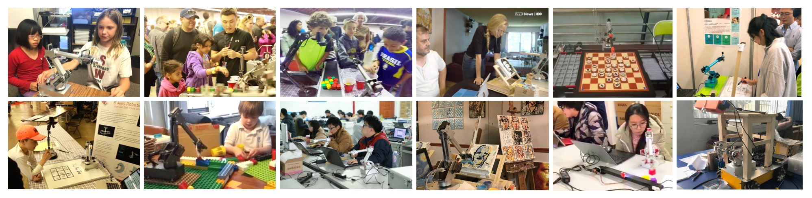
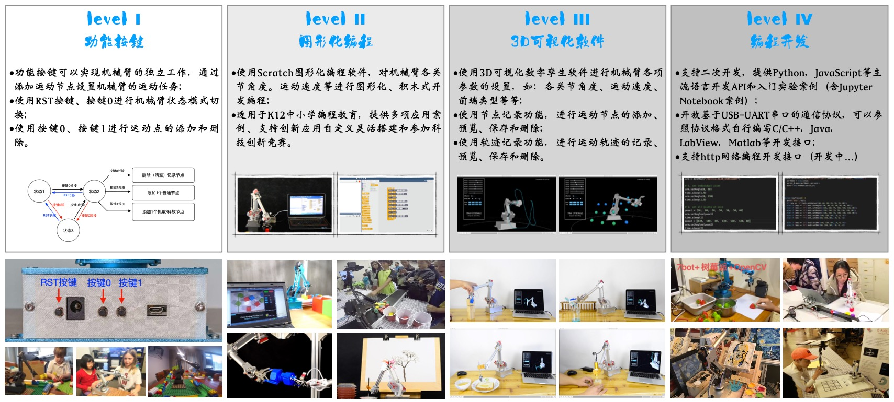

    
[简体中文](../README.md) / English

# 7Bot Desktop Robotic Arm for AI Applications

 

## Introduction
The 7Bot Desktop Intelligent Robotic Arm is a desktop robotic arm developed and designed by the PineconeAI team, suitable for rapid setup, testing, and deployment of AI application scenarios, with rich functionality and flexibility of use. It provides a one-stop solution for students, teachers, researchers, enterprises, and developers in the fields of artificial intelligence education and scientific research, and is widely used globally.

7Bot Intelligent Application Video Collection [【Youtube】](https://youtu.be/4htib_-zlBI)    [【Bilibili】](https://player.bilibili.com/player.html?bvid=BV1UU4y1G7TW&page=1)

The 7Bot robotic arm, as a general-purpose hardware peripheral, uses simple and easy-to-use secondary development APIs (Application Programming Interfaces), which can be very conveniently used for secondary development on general platforms such as computers, development boards (such as NVIDIA Jetson series development boards, Raspberry Pi, ARM development boards), etc. It can seamlessly integrate with artificial intelligence and robotics application tools and resources such as TensorFlow/Pytorch deep learning frameworks, ROS robot operating system, OpenCV computer vision library, etc., for various types of artificial intelligence application development and rapid prototyping.

 

## Usage
The simple and easy-to-use approach of the 7Bot robotic arm, with flexible and diverse scenario setups, is very suitable for popularizing artificial intelligence and robotics. It allows primary and secondary school students to easily operate, use, and experience the many joys of robotics and artificial intelligence applications without needing to understand complex and profound theoretical knowledge, thereby increasing interest in STEM subjects and inspiring students' innovative thinking abilities. Currently supported usage methods include:

1. Function buttons: Built-in button operation functions, through the use of function buttons on the device base, you can easily complete robotic arm motion teaching and motion control arrangement;

2. Graphical programming: 7Bot supports graphical programming in combination with Scratch, allowing development and customization of flexible robotic arm application scenarios through a graphical interface;

3. 3D visualization software: Using the accompanying 3D visualization software, you can intuitively set various parameters of the robotic arm, visually see the robot's motion trajectory, robot status, robot control commands, etc. through digital twin effects, and use software functions to implement complex robotic arm tasks;

4. Programming development: Supports multiple communication methods, comes with Python language programming learning, Jupyter Notebook experimental cases, as well as course teaching experiments on various application topics such as motion planning, computer vision, and deep learning.

For details, please refer to the [Usage Instructions](usage.md).

 

## Peripherals
The 7Bot Desktop Intelligent Robotic Arm supports a variety of peripheral configurations for building intelligent application scenarios.

 

## Features
The 7Bot Desktop Intelligent Robotic Arm has the following features and specific parameters:

 

## Documentation
| No. | Name    | Content  |
|-----|--------|-------|
| 1   | [7Bot Desktop Robotic Arm User Manual](7Bot桌面机械臂使用说明书.pdf)     | Hardware, usage, and development instructions for the robotic arm   |
| 2   | [7Bot Robotic Arm Programming Development Guide (Python Version)](7Bot机械臂编程开发指南（Python版）.pdf)     | Python API development and usage guide for the robotic arm   |
| 3   |      |     |

 

## Tutorials

Jupyter Notebook tutorials based on Python language, for quickly getting started with various functions of the 7Bot robotic arm and basics of AI application development.

| No. | Name    | Content   |
|-----|--------|-------|
| 1   | [Setting up Jupyter Development Environment](../tutorials/Jupyter开发环境搭建.md)     |  Set up Jupyter development environment, install Python libraries   |
| 2   | [7Bot Robotic Arm Motion Control Basics](../tutorials/7Bot机械臂运动控制基础教程.ipynb)     | Use Python API to achieve programmatic control of various functional states of the robotic arm   |
| 3   | [WiFi Network Communication (Based on Socket)](../tutorials/TBD)     | Implement communication between the robotic arm and computer through Socket communication, facilitating AIoT application setup   |
| 4   | [Using Robot Operating System (ROS2)](../tutorials/TBD)     | Usage and development of robotic arm in ROS2   |
| 5   |      |     |

 

## Basic Cases

Jupyter Notebook tutorials based on Python language, for quickly getting started with various basic functional application development of the 7Bot robotic arm.

| No. | Name    | Content   |
|-----|--------|-------|
| 1   | [Trajectory Recording and Motion Reproduction](../demos/轨迹记录及运动复现.md)     |  Implement robotic arm trajectory recording and motion reproduction through Python API   |
| 2   | [Robotic Arm Avatar](../demos/机械臂Avatar.md)     |  Implement Avatar motion synchronization control of one robotic arm over another through Python API   |
| 3   |      |     |

 

## AI Application Cases

| No. | Name    | Content   |
|------|--------|-------|
| 1      | [Tic-Tac-Toe](../demos/TicTacToe.md)     | Implement intelligent human-machine Tic-Tac-Toe game using computer vision, deep learning, and MinMax algorithm |
| 2      | [Conveyor Belt Sorting](../demos/Sorting.md)     | Intelligent sorting application combining computer vision, deep learning, and conveyor belt hardware devices |
| 3      | [Gesture Control](../demos/HandCtrl.md)     | Implement gesture control of the robotic arm using the Mediapipe library |
| 4      | [Dual-Arm Interaction](../demos/DualArmHRI.md)     | Human-robot interaction system application combining computer vision, deep learning, natural language, and LLM   |
| 5   |      |     |